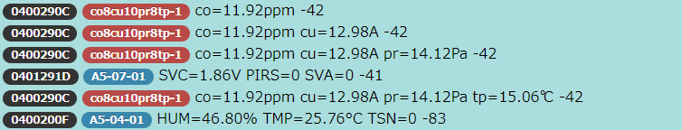

# GP-SmartNotation

Representation for EnOcean Generic Profile Smart Notation

EnOcean GP (Generic Profile) をゲートウェイ等の機器で実装する場合に、EEPと比べて使い勝手がわるいため、同じ使い勝手となる方法を考案した。

## EEPと同じ使い勝手
- プロファイル名の自動割り当て
- センサー種類または概略を簡易表示
- EEP Shortcutと同様のデータポイント自動割り当て
- EEPは英大文字で始まるのに対して、GP-SmartNotationによるプロファイル番号は、英小文字で始まるため、容易に区別可能

### 8ビット温度センサーの標記例
- EEP: A5-02-01
- GP-Smart: tp8-1

### ログ表示サンプル 

### 自動生成GP識別文字列プロファイル名

### Sensor type and Shortcut name

| センサー種別 | 略称 |
|:-:|:-:|
| Acceleration | ac |
| Angle | ag |
| Angular_velocity | av |
| Area | ar |
| Concentration | co |
| Current | cu |
| Distance | di |
| Electric_field_strength | ef |
| Energy | en |
| Number | nm |
| Force | fo |
| Frequency | fq |
| Heat_flux_density | hf |
| Impulse | ip |
| Luminance | lu |
| Magnetic_field_strength | mf |
| Mass | ms |
| Mass_density | md |
| Mass_flow | mf |
| Power | pw |
| Pressure | pr |
| Humidity | hu |
| Resistance | rs |
| Temperature | tp |
| Time | tm |
| Torque | tq |
| Velocity | vc |
| Voltage | vl |
| Volume | vo |
| Volumetric_Flow | vf |
| Sound_Pressure_Level | sp |

